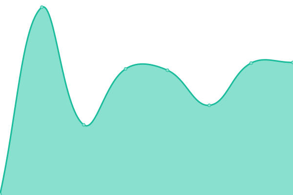

# Status for YunLeFun sites

Built with [upptime](https://upptime.js.org/).

This repository contains the open-source uptime monitor and status page for [YunLeFun Studio | 云乐坊工作室](https://yunle.fun), powered by [Upptime](https://github.com/upptime/upptime).

With [Upptime](https://upptime.js.org), you can get your own unlimited and free uptime monitor and status page, powered entirely by a GitHub repository. We use [Issues](https://github.com/YunLeFun/status/issues) as incident reports, [Actions](https://github.com/YunLeFun/status/actions) as uptime monitors, and [Pages](https://status.yunle.fun) for the status page.

<!--start: status pages-->
<!-- This summary is generated by Upptime (https://github.com/upptime/upptime) -->
<!-- Do not edit this manually, your changes will be overwritten -->
<!-- prettier-ignore -->
| URL | Status | History | Response Time | Uptime |
| --- | ------ | ------- | ------------- | ------ |
|  [YunLeFun Home](https://yunle.fun) | 🟩 Up | [yun-le-fun-home.yml](https://github.com/YunLeFun/status/commits/HEAD/history/yun-le-fun-home.yml) | 

 288ms
     
 | 

<a href="https://status.yunle.fun/history/yun-le-fun-home">100.00%</a>
    

|  [YunLeFun App](https://app.yunle.fun) | 🟩 Up | [yun-le-fun-app.yml](https://github.com/YunLeFun/status/commits/HEAD/history/yun-le-fun-app.yml) | 

 2146ms
     
 | 

<a href="https://status.yunle.fun/history/yun-le-fun-app">99.78%</a>
    

<!--end: status pages-->

[**Visit our status website →**](https://status.yunle.fun)

## 📄 License

- Powered by: [Upptime](https://github.com/upptime/upptime)
- Code: [MIT](./LICENSE) © [YunLeFun Studio | 云乐坊工作室](https://yunle.fun)
- Data in the `./history` directory: [Open Database License](https://opendatacommons.org/licenses/odbl/1-0/)
